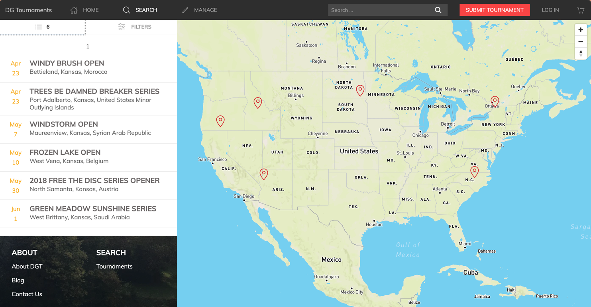

## DG Tournaments (Updated to L11)

After years of collecting dust in the archives, I decided to update [this project](https://github.com/philmareu/dg-tournaments-app-v1) all the way from PHP 5/Laravel 5 to PHP 8.3/Laravel 11. It wasn't easy, but I was determined to see this project run again. However, I have plans to build upon this version.

I might write up some install directions if anyone is interested in playing with it. Also, although I've updated the framework and made appropriate fixes to make it work, the code is mostly the same as I wrote it in 2017.

Oh yeah, check it out on the web at [https://legacy.dgtournaments.com](https://legacy.dgtournaments.com).
